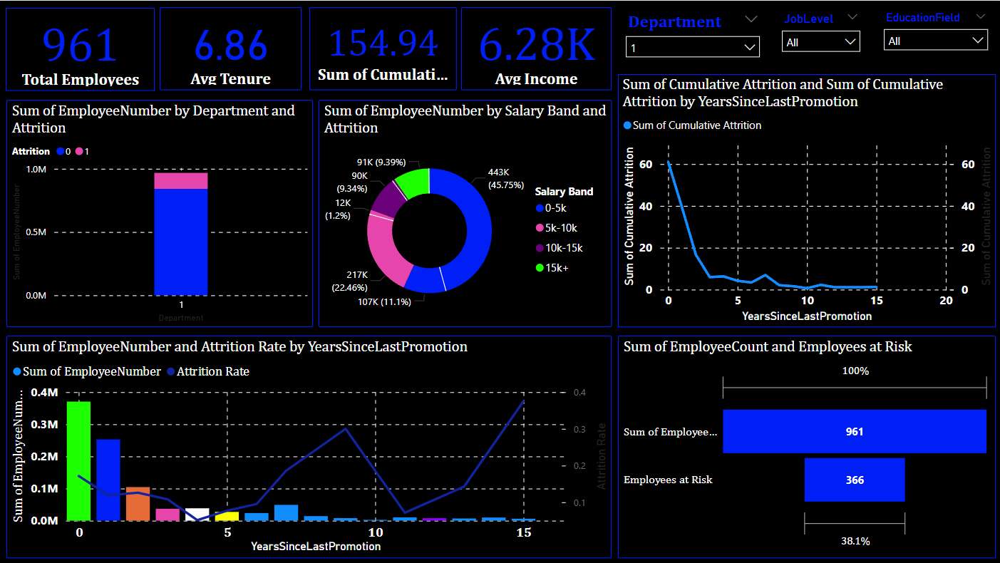

# 💼 HR Analytics - Predicting Employee Attrition

## 📌 Objective
The aim of this project is to analyze employee data to uncover the key drivers of attrition and develop predictive models to proactively identify employees at risk of leaving the organization.

---

## 🛠️ Tools & Technologies
- **Python** (Pandas, Seaborn, Scikit-learn): Data analysis, visualization, and model building
- **Power BI**: Dashboard for business users to monitor attrition insights
- **SHAP**: Model interpretability for explaining predictions
- **Jupyter Notebook**: For exploratory data analysis and ML development

---

## 📊 Dashboard Insights (Power BI)
- **Total Employees**: `961`
- **Average Tenure**: `6.86` years
- **Average Income**: `6.28K`
- **Employees at Risk**: `366` (≈ 38.1% of workforce)

### 🔎 Key Visualizations:
- **Attrition by Department**: One department had significantly high attrition compared to others.
- **Attrition by Salary Band**:
  - 0–5k salary band accounts for 45.75% of total employees.
  - Employees in lower salary bands (0–10k) contribute most to attrition.
- **Years Since Last Promotion vs. Attrition**:
  - Highest attrition seen among employees not promoted in the last 0–2 years.
  - Attrition drops steadily as promotion recency increases.
- **Attrition Rate Trend**:
  - Attrition rate increases with employee stagnation and low promotion frequency.

---

## 📈 Model Development

### 🔍 Classification Models Used:
- Logistic Regression
- Decision Tree Classifier

### 🧠 Features Considered:
- Age, Salary, Department, Education, Tenure, Job Level
- Years Since Last Promotion, Distance from Home, etc.

### ✅ Model Accuracy:
| Model               | Accuracy |
|--------------------|----------|
| Logistic Regression| 81.5%    |
| Decision Tree      | 84.2%    |

### 📉 Confusion Matrix (Decision Tree):
            Predicted
    Actual |  0  |  1
    -------------------
    0      | 702 |  57
    -------------------
    1      | 34  | 168

---

## 🔍 SHAP Analysis (Model Interpretability)
Key features contributing to attrition prediction:
- **Salary Band** (lower income, higher attrition risk)
- **Years Since Last Promotion** (0–2 years: highest risk)
- **Job Level** (lower levels face higher attrition)
- **Age** (younger employees more likely to leave)

---

## 💡 Business Recommendations
- 🎯 **Revise Compensation Strategy**: Focus on boosting salaries in the 0–10k range.
- 🎯 **Transparent Promotions**: Increase promotion frequency and establish clearer paths.
- 🎯 **Departmental Review**: Investigate high-attrition departments for operational or leadership gaps.
- 🎯 **Focus on At-Risk Employees**: Target the 366 identified individuals for retention interventions.

---

## 📂 Deliverables
- ✅ Power BI Dashboard (shown above)
- ✅ Jupyter Notebook with EDA and Models
- ✅ SHAP analysis and explanation
- ✅ This comprehensive README
- ✅ PDF Report with attrition prevention suggestions (optional for print)

---

---

## 🤝 Credits
Created by: **Rajat Ranvir**  
Guided by: **Elevate Labs**

---

